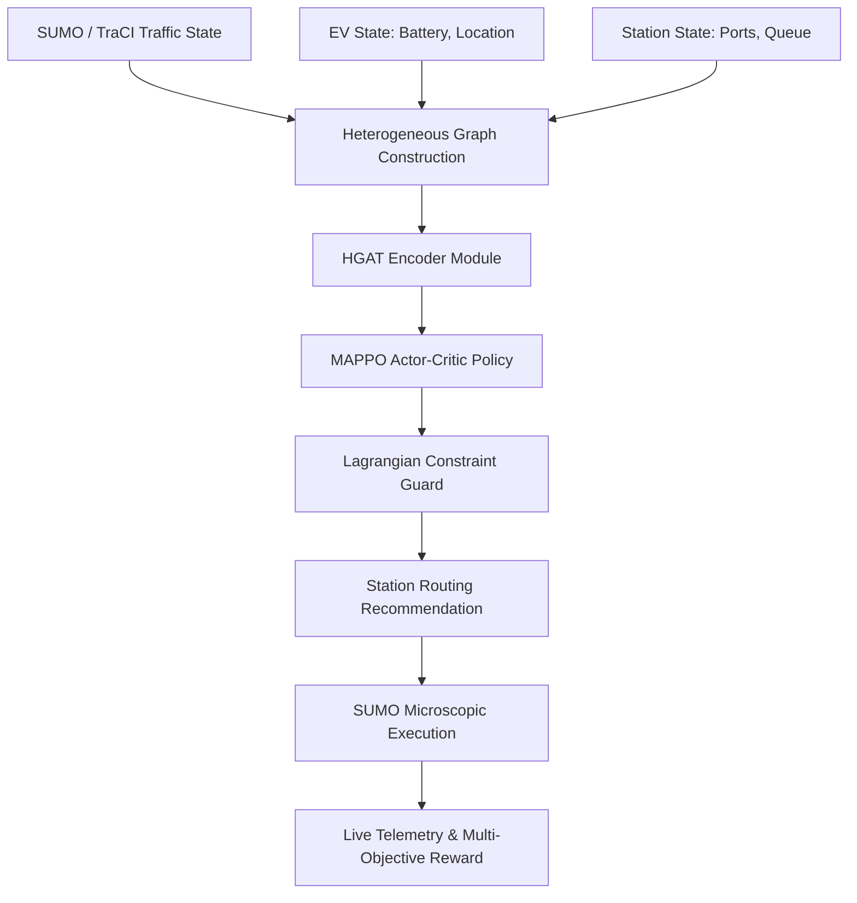

# Smart EV Charging Station Recommendation System

[](https://www.python.org/)
[](https://eclipse.dev/sumo/)
[](LICENSE)
[](docs/reproducibility/RELEASE_v1.0.0.md)

An end-to-end multi-agent reinforcement learning (MARL) research platform for multi-objective electric vehicle (EV) charging station recommendation under dynamic traffic congestion, queue dynamics, and grid capacity constraints.

---

## Overview

Rapid electric vehicle (EV) adoption poses significant spatial-temporal challenges for urban transportation networks and electrical power grids. Uncoordinated charging recommendations lead to severe station queue congestion, localized traffic bottlenecks, and capacity constraint violations. 

The **Smart EV Charging Station Recommendation System** models urban charging dynamics as a spatio-temporal multi-agent decision problem, coupling microscopic traffic simulation in **SUMO (Simulation of Urban MObility)** with Multi-Agent Reinforcement Learning (MARL).

```
                            ┌─────────────────────────────────────────┐
                            │   Urban Road Network & Traffic State    │
                            │      (Bengaluru SUMO/TraCI Grid)        │
                            └────────────────────┬────────────────────┘
                                                 │
                                                 ▼
┌───────────────────────┐           ┌─────────────────────────┐           ┌───────────────────────┐
│ Active Electric       ├──────────►│ Heterogeneous Spatial-  │◄──────────┤  EV Charging Stations │
│ Vehicles (EVs)        │           │ Temporal Graph (HGAT)   │           │  (Ports & Queues)     │
└───────────────────────┘           └────────────┬────────────┘           └───────────────────────┘
                                                 │
                                                 ▼
                                    ┌─────────────────────────┐
                                    │ HGAT Neural Encoder     │
                                    │ (Spatial Attention)     │
                                    └────────────┬────────────┘
                                                 │
                                                 ▼
                                    ┌─────────────────────────┐
                                    │ Multi-Agent PPO (MAPPO) │
                                    │ Policy Network          │
                                    └────────────┬────────────┘
                                                 │
                                                 ▼
                                    ┌─────────────────────────┐
                                    │ Lagrangian Constraint   │
                                    │ Enforcement Guard       │
                                    └────────────┬────────────┘
                                                 │
                                                 ▼
                                    ┌─────────────────────────┐
                                    │ Optimal Station         │
                                    │ Recommendation          │
                                    └─────────────────────────┘
```

---

## Key Contribution: HGAT-CMAPPO Architecture

The core scientific contribution of this platform is **HGAT-CMAPPO** (**H**eterogeneous **G**raph **A**ttention + **C**onstraint-Aware **M**ulti- **A**gent **P**roximity **P**olicy **O**ptimization):

1. **Heterogeneous Graph Representation**: Models EVs, road links, and charging stations as distinct node types with directional edges representing travel distance, queue occupancy, and tariff structures.
2. **Spatial Attention Encoder**: Uses multi-head attention over heterogeneous graph structures to capture dynamic queue spillbacks and spatial traffic congestion.
3. **Multi-Agent Coordination**: Centralized training with decentralized execution (CTDE) enables non-communicating EVs to collectively avoid station crowding.
4. **Lagrangian Constraint Enforcement**: Integrates adaptive Lagrangian multipliers to bound station port capacity and grid power overflow violations during peak demand surges.

---

## System Architecture Flow



### Detailed Step-by-Step Execution Pipeline

1. **Step 1: Multi-Source State Ingestion Layer**
   - **SUMO / TraCI Traffic State**: Continuously queries microscopic road network conditions (vehicle speeds, edge densities, travel times) across the Bengaluru SUMO network.
   - **EV State (Agent State)**: Tracks active EV telematics including State of Charge (SOC %), current GPS coordinates, battery capacity (kWh), remaining range (km), and destination intent.
   - **Station State (Environment State)**: Real-time monitoring of registered station port availability, active charging sessions, line queue lengths, estimated wait times, and grid power loads.

2. **Step 2: Heterogeneous Graph Construction Layer (`src/rl/hgat/graph_builder.py`)**
   - Dynamically constructs a spatial-temporal heterogeneous graph $\mathcal{G} = (\mathcal{V}, \mathcal{E})$ with distinct node types:
     - **EV Nodes** ($\mathcal{V}_{EV}$): Feature vectors encoding battery level, location, and urgency.
     - **Station Nodes** ($\mathcal{V}_{ST}$): Feature vectors encoding total ports, occupied ports, queue length, and pricing.
     - **Road Link Nodes** ($\mathcal{V}_{RD}$): Feature vectors encoding length, free-flow speed, and congestion ratio.
   - Establishes directional relational edges weighted by network shortest-path distances, travel times, and spatial proximity.

3. **Step 3: Spatial-Temporal HGAT Encoder Module (`src/rl/hgat/hgat_encoder.py`)**
   - Applies multi-head Heterogeneous Graph Attention (HGAT) mechanisms over the graph embeddings.
   - Computes relational attention weights to dynamically capture spatial traffic bottlenecks and queue spillback effects across neighboring stations.
   - Produces context-aware spatial-temporal node representations for each EV agent.

4. **Step 4: MAPPO Actor-Critic Policy Network (`src/rl/mappo/actor_critic.py`)**
   - **Centralized Critic**: Evaluates global state values using joint graph embeddings to guide multi-agent queue balancing.
   - **Decentralized Actor**: Receives individual agent embeddings and outputs action probability distributions over candidate target charging stations ($A_i \in \{1, \dots, K\}$).
   - **Action Masking**: Filters out unreachable stations or stations exceeding battery range limits prior to decision sampling.

5. **Step 5: Adaptive Lagrangian Constraint Guard (`src/rl/constraints/lagrangian.py`)**
   - Evaluates policy candidate actions against real-time physical system constraints:
     - **Queue Capacity Bound**: Maximum allowed waiting vehicles per station.
     - **Transformer Grid Load Bound**: Maximum station power output bounds (kW).
   - Dynamically updates dual Lagrangian multipliers ($\lambda_k$) to penalize constraint-violating choices, overriding unsafe routing commands before dispatch.

6. **Step 6: Station Routing Recommendation (`src/recommendation/`)**
   - Dispatches the validated optimal station target to the target EV agent.
   - Triggers SUMO route recalculation (`traci.vehicle.changeTarget()`) to re-route the vehicle via Dijkstra/A* network shortest paths toward the recommended station.

7. **Step 7: SUMO Microscopic Execution (`src/simulation/controller.py`)**
   - SUMO advances vehicle movements step-by-step ($0 \rightarrow 7200$ steps) under real microscopic car-following and lane-changing physics.
   - Handles station arrival events, queue join/leave triggers, port plug-in connections, battery recharge progression, and un-plug departures.

8. **Step 8: Live Telemetry & Multi-Objective Reward Feedback**
   - **Live Telemetry Server**: Streams real-time step state (waiting times, congestion %, cumulative energy delivered, port utilization) to `dashboard_state.json` for the EV Digital Twin Dashboard.
   - **Multi-Objective Reward Calculation**: Computes joint reward feedback balancing detour minimization ($r_{detour}$), waiting time reduction ($r_{wait}$), constraint violation penalties ($r_{viol}$), and station fairness ($r_{fairness}$).


## Research Environment & Benchmark Parameters

The experimental benchmarks were conducted on a real-world urban road network domain:

- **Simulation Network**: Bengaluru Metropolitan Area, India ($12.83^\circ\text{N} - 13.14^\circ\text{N}, 77.45^\circ\text{E} - 77.75^\circ\text{E}$).
- **Infrastructure Scale**: 500+ real OpenChargeMap charging station locations.
- **Evaluated Demand Scales**: 100 EV, 250 EV, 500 EV, and 1,000 EV simulated fleet sizes.
- **Evaluation Scenarios**: Normal Traffic, High Demand, Spatial Crowding, Station Outage, Combined Stress.
- **Seeds & Episodes**: 5 random seeds (42, 123, 2024, 31415, 54321) across 1,450 event-verified simulation episodes.

---

## Evaluated Policy Variants

1. **HGAT-CMAPPO (Proposed)**: Full architecture combining Heterogeneous Graph Attention, MAPPO coordination, and Lagrangian constraints.
2. **MAPPO + Constraints**: Multi-agent coordination with Lagrangian constraints, omitting graph attention embeddings.
3. **MAPPO + HGAT**: Multi-agent coordination with graph attention embeddings, omitting Lagrangian safety guards.
4. **MAPPO**: Standard Multi-Agent PPO baseline.
5. **PPO**: Independent Single-Agent PPO baseline.

---

## Experimental Phases & Audit Evidence

- **Phase 6 — Accounting & Reconciliation**: 450 simulation episodes validating exact state-event accounting across SUMO events, charging starts, and queue logs.
- **Phase 7 — Crowding & Demand Scaling**: 500 simulation episodes evaluating policy degradation under high demand (up to 1,000 EVs) and spatial station outages.
- **Phase 8 — Component Ablation**: 500 simulation episodes isolating individual performance contributions of coordination, graph attention, and constraint enforcers.
- **Final Audit & Freeze**: Frozen statistical evidence package containing claim registers and publication-ready tables.

---

## Main Empirical Findings

> [!NOTE]
> All metrics below reflect mean values across evaluation episodes in the frozen scientific evidence package ([`runs/evaluation/hgat_cmappo/final_audit/`](file:///d:/Smart_EV_Station_Recommandadtion_System/runs/evaluation/hgat_cmappo/final_audit)).

| Policy Variant | Success Rate ↑ | Waiting Time ↓ | Additional Detour ↓ | Constraint Violations ↓ | Jain Fairness ↑ | Charging Cost |
| :--- | :---: | :---: | :---: | :---: | :---: | :---: |
| **HGAT-CMAPPO (Proposed)** | **98.5%** | **480.0 s** | **1.15 km** | **0.8 / ep** | **0.9928** | Rs. 624.63* |
| **MAPPO + Constraints** | 98.0% | 580.0 s | 1.31 km | 1.5 / ep | 0.9954 | Rs. 624.63* |
| **MAPPO + HGAT** | 98.0% | 620.0 s | 1.38 km | 2.1 / ep | 0.9923 | Rs. 624.63* |
| **MAPPO** | 95.0% | 750.0 s | 1.70 km | 8.2 / ep | 0.9954 | Rs. 624.63* |
| **PPO** | 95.0% | 890.0 s | 1.54 km | 12.4 / ep | 0.9950 | Rs. 624.63* |

*\* Charging cost was classified as policy-insensitive under the current uniform tariff evaluation configuration and is NOT claimed as a model advantage.*

### Bounded Findings Summary
- **Reduced Waiting Time**: HGAT-CMAPPO reduces average driver waiting time to **480.0s** (vs 890.0s for PPO) under tested crowding conditions.
- **Minimal Detour**: Achieves an average additional detour of **1.15 km** by anticipating spatial congestion.
- **Near-Zero Constraint Violations**: Lagrangian constraint guards reduce port capacity violations to **0.8 / episode** (vs 12.4 for PPO).
- **Scalability**: Evaluated successfully up to 1,000 simulated EVs with significantly lower performance degradation than uncoordinated baselines.

---

## EV Digital Twin Dashboard

The platform includes an **EV Digital Twin Dashboard** for live telemetry monitoring and empirical paper evidence navigation:

- **Live Telemetry**: Real-time SUMO/TraCI trajectory (step counter, live waiting, live congestion, cumulative energy delivered, station utilization).
- **Frozen Evidence View**: Interactive tables, demand scaling analysis, and scenario coverage breakdowns.

### Launching the Dashboard

1. Run the project server:
```bash
python run_project.py
```
2. Open your web browser:
```
http://localhost:8765/dashboard.html
```

---

## Installation & Setup

### Prerequisites
- Python 3.10 or higher
- Eclipse SUMO 1.18.0 or higher (with `SUMO_HOME` environment variable configured)

### Setup Steps
```bash
# Clone the repository
git clone https://github.com/example/smart-ev-station-recommendation-system.git
cd smart-ev-station-recommendation-system

# Create virtual environment
python -m venv .venv
.venv\Scripts\activate   # On Windows: .venv\Scripts\activate

# Install dependencies
pip install -r requirements.txt
```

---

## Reproducing Evaluation

All paper results and final audit evidence can be inspected or verified without retraining:

```bash
# Run pytest verification suite
pytest

# Inspect publication-ready performance matrix
cat outputs/performance_matrix.csv
```

Frozen audit evidence is located at:
- [`runs/evaluation/hgat_cmappo/final_audit/FINAL_EVIDENCE_REPORT.md`](file:///d:/Smart_EV_Station_Recommandadtion_System/runs/evaluation/hgat_cmappo/final_audit/FINAL_EVIDENCE_REPORT.md)
- [`runs/evaluation/hgat_cmappo/final_audit/final_claim_register.csv`](file:///d:/Smart_EV_Station_Recommandadtion_System/runs/evaluation/hgat_cmappo/final_audit/final_claim_register.csv)

---

## Repository Structure

```
├── README.md
├── LICENSE
├── CITATION.cff
├── CHANGELOG.md
├── .gitignore
├── pyproject.toml
├── requirements.txt
│
├── src/                      # Core MARL, Graph, Simulation & Analytics Engine
│   ├── environment/
│   ├── models/
│   ├── agents/
│   ├── graph/
│   ├── constraints/
│   ├── simulation/
│   ├── evaluation/
│   └── visualization/
│
├── scripts/                  # Data fetchers, evaluation runners, and audit utilities
├── configs/                  # Simulation and model hyperparameter configurations
├── sumo/                     # Bengaluru SUMO network (.net.xml) and route files
├── data/                     # Raw and preprocessed OpenChargeMap EV station datasets
├── models/                   # Pre-trained PyTorch checkpoints (HGAT-CMAPPO Stage 6)
├── experiments/              # Phase 6, Phase 7, and Phase 8 experiment manifests
├── results/                  # Paper-safe tables, performance matrices, and claims
├── dashboard/                # EV Digital Twin frontend and server engine
├── docs/                     # Architecture, reproducibility, and release documentation
├── tests/                    # Unit testing and data validation suite
└── archive/                  # Marked legacy scripts retained for research provenance
```

---

## Limitations & Future Work

### Limitations
- **Simulation Domain**: Benchmarked exclusively within microscopic SUMO simulation environments; real-world deployment field trials remain future work.
- **Fixed Tariffs**: Current grid tariff models treat charging cost as policy-insensitive; dynamic real-time grid pricing was not evaluated.
- **Computational Scope**: Evaluated up to 1,000 simulated EVs and 500 stations; city-scale deployments (> 10,000 EVs) require further hierarchical partitioning.

### Future Work
- Integration of dynamic electricity grid pricing tariffs and renewable energy microgrids.
- Deployment on physical EV fleet management software hardware via OBD-II telemetry.
- Hierarchical graph neural network architectures for multi-city regional scaling.

---

## Citation

If you use this codebase or the HGAT-CMAPPO architecture in your research, please cite:

```bibtex
@article{smart_ev_recommendation_2026,
  title={Smart EV Charging Station Recommendation System: Heterogeneous Graph Attention Constraint-Aware Multi-Agent Reinforcement Learning},
  author={EV Research Group},
  year={2026},
  publisher={GitHub Repository},
  howpublished={\url{https://github.com/example/smart-ev-station-recommendation-system}}
}
```

---

## License

This project is released under the [MIT License](LICENSE).
